# TLS Fingerprinting: Design, Implementation, and Evaluation of a Dual-Engine Passive Identification Pipeline

*Draft report — Python + C++ implementations*

> **Note on this draft:** This is a first full pass covering every section on the outline, written directly against the current codebase (`code/python`, `code/cpp`, `code/gui`, `code/db`, `code/reference`). Section X (Benchmarks) is scaffolded with the exact methodology and metrics the C++ engine already reports, but the actual numbers are left as `TODO` placeholders — they should come from real runs on your hardware rather than be invented. Everything else is written to be submittable with light editing.

---

## 1. Introduction

**TLS (Transport Layer Security) fingerprinting** is the practice of passively identifying the software that originated (or terminated) a TLS connection by observing the *structure* of its handshake messages, rather than their content. Every TLS client and server library — curl, a browser's network stack, Java's `HttpsURLConnection`, a piece of malware's custom TLS implementation — builds its handshake messages (`ClientHello`, `ServerHello`) slightly differently: it offers cipher suites in a particular order, advertises a particular set of extensions, supports a particular set of elliptic curves. None of this is secret or encrypted — the handshake itself has to be sent in the clear so the two sides can agree on how to encrypt everything that follows. That means a passive observer sitting on the wire (or reading a pcap after the fact) can extract this structural information and compute a fingerprint from it, without ever needing to decrypt the session.

This project implements that idea end-to-end, twice: once in **Python**, optimized for clarity, testability, and interactive use (via a PyQt6 GUI), and once in **C++**, optimized for raw packet-processing throughput. Both engines:

- Reassemble TCP streams from raw packets (offline pcap or live capture),
- Extract TLS `ClientHello` / `ServerHello` handshake messages byte-by-byte, with no reliance on a TLS library's own protocol dissection,
- Compute **JA3** / **JA3S** fingerprints (and, in the C++ engine, **JA4** / **JA4S**),
- Look fingerprints up against a maintained database of known clients and servers, and
- Report matches (or flag unknowns) to an analyst.

The rest of this report covers the theory behind the fingerprints themselves, what we built, the engineering decisions we made (including a few we reversed), a comparison of the two engines, how we validated correctness, how the system should be benchmarked, and — per the assignment's explicit ask — a discussion of where this technique is genuinely useful for security monitoring and where it breaks down.

---

## 2. Background and Theory: How TLS Fingerprinting Works, Byte by Byte

TLS fingerprinting only works because the handshake is layered, self-describing, and sent in plaintext. Understanding the fingerprint means understanding the framing.

### 2.1 The Record Layer

Every TLS message on the wire is wrapped in a 5-byte **record header**:

```
Byte 0        Bytes 1–2              Bytes 3–4
+--------+------------------------+------------------------+
| Content|  Legacy Record Version |   Fragment Length       |
|  Type  |     (e.g. 0x0301)      |        (uint16, BE)     |
+--------+------------------------+------------------------+
```

Content types relevant to this project: `20` = ChangeCipherSpec, `21` = Alert, `22` = Handshake, `23` = Application Data. Only content type `22` carries the messages we care about. Critically, JA3 explicitly ignores the "legacy record version" field in bytes 1–2 (it's a historical artifact TLS 1.3 repurposes/freezes for compatibility) — the *real* protocol version lives one layer deeper, inside the handshake body itself.

### 2.2 The Handshake Layer

Each `Handshake` record's fragment contains one or more **handshake messages**, each wrapped in a 4-byte header:

```
Byte 0     Bytes 1–3
+--------+------------------------+
|  Msg   |   Body Length (uint24) |
|  Type  |                        |
+--------+------------------------+
```

`msg_type = 1` is `ClientHello`, `msg_type = 2` is `ServerHello`. These are the only two message types this project parses.

### 2.3 The ClientHello Body — the JA3 Source Fields

Stripped of its two wrapper headers, a `ClientHello` body is a chain of type-length-value (TLV) structures, read strictly in order:

| Field | Size | Notes |
|---|---|---|
| Version | 2 bytes | The *true* handshake version (e.g. `0x0303` = TLS 1.2). **JA3 field 1.** |
| Random | 32 bytes | Skipped entirely — no fingerprinting value. |
| Session ID | 1-byte length + N bytes | Skipped. |
| Cipher Suites | 2-byte length + N×2-byte suite IDs | The offered cipher list, in wire order. **JA3 field 2.** |
| Compression Methods | 1-byte length + N bytes | Skipped (TLS 1.3 mandates null compression). |
| Extensions | 2-byte total length, then repeated `{type:2, len:2, data:len}` | Each extension's type code becomes **JA3 field 3**; two specific extensions are unpacked further. |

Two extensions get parsed one level deeper because their *contents* also feed the fingerprint:

- **`0x000a` — Supported Groups (elliptic curves).** A 2-byte list length followed by 2-byte curve IDs. → **JA3 field 4.**
- **`0x000b` — EC Point Formats.** A 1-byte list length followed by 1-byte format IDs. → **JA3 field 5.**

One extension is unpacked purely for operator context, not for the fingerprint itself:

- **`0x0000` — Server Name Indication (SNI).** List length (2) → name type (1, `0` = hostname) → name length (2) → the hostname bytes. This gives an analyst the destination domain even though the fingerprint doesn't use it.

Concatenating the five JA3 fields with commas (each internal list hyphen-joined) produces the **JA3 string**:

```
TLSVersion,Cipher1-Cipher2-...,Ext1-Ext2-...,Curve1-Curve2-...,Fmt1-Fmt2-...
```

The **JA3 hash** is simply the MD5 hex digest of that string. **JA3S** is the server-side mirror: `TLSVersion,SelectedCipher,Ext1-Ext2-...`, computed from the `ServerHello`.

### 2.4 GREASE — and why it has to be filtered

RFC 8701 defines **GREASE** ("Generate Random Extensions And Sustain Extensibility"): 16 reserved values of the form `0x?A?A` (high byte equals low byte, e.g. `0x0A0A`, `0x1A1A`, ... `0xFAFA`), spaced evenly across the 16-bit space. A conformant client is expected to randomly sprinkle a GREASE value into its cipher list, extension list, and curve list on *every* connection — purely to force servers and middleboxes to tolerate unknown values, preventing the ecosystem from ossifying around whatever values happen to be in use today. If a fingerprinting tool didn't filter these out, a single client (e.g. Chrome) would produce a different JA3 hash on almost every connection, since the random GREASE value would land in a different position in the sorted... except JA3 doesn't sort — it preserves wire order — so a GREASE value would also perturb the position of every subsequent real value. Filtering GREASE before hashing is therefore not optional; it is required for the fingerprint to be stable at all for GREASE-emitting clients.

### 2.5 JA4 / JA4S — a newer, order-independent design

JA4 (and its server counterpart JA4S) restructure the fingerprint into three explicit parts, `<a>_<b>_<c>`, designed to be readable at a glance and — critically — resistant to reordering:

- **`a`** — a compact, human-readable prefix: protocol (`t` for TCP), negotiated/offered TLS version, whether SNI was present and pointed at a hostname (`d`) vs. an IP literal or nothing (`i`), a zero-padded count of non-GREASE ciphers, a zero-padded count of non-GREASE extensions, and the first/last characters of the negotiated ALPN protocol.
- **`b`** — the cipher suites, **sorted** (not wire order) and hex-joined, then hashed (truncated SHA-256).
- **`c`** — the extensions (excluding SNI and ALPN, which are already summarized in `a`), also **sorted**, hashed together with the `signature_algorithms` list — which, notably, is *not* sorted, since its order is considered meaningful and rarely subject to deliberate randomization.

The decision to sort ciphers and extensions before hashing is the single biggest theoretical difference from JA3, and it is directly a response to the evasion technique discussed in Section 11: if a client shuffles the order it lists ciphers/extensions in, JA3 changes completely, but JA4 does not.

---

## 3. Project Scope: What We Built

- **Two independent parsing/fingerprinting engines** implementing the theory above: a Python engine (`code/python`) and a C++ engine (`code/cpp`).
- **Offline pcap analysis** in both engines (`dpkt` in Python via `read_pcap()`; `libpcap` directly in C++ via `pcap_open_offline`).
- **Live capture** in both engines — Scapy-driven packet delivery in Python (`gui/workers.py`'s `LiveCaptureWorker`), and native `pcap_open_live` in C++.
- **Stateful TCP reassembly**, independently implemented per engine, handling out-of-order segments, retransmissions, partial overlaps, and handshake messages that span multiple TLS records or multiple TCP segments.
- **JA3 / JA3S** in both engines; **JA4 / JA4S** additionally implemented in the C++ engine (see Section 12 for why this is currently asymmetric).
- **A fingerprint database** with two tiers: a flat legacy JSON hash→label map, and a Redis-backed structured store (`FingerprintRecord`) covering all four fingerprint kinds, seeded from a curated self-captured catalog (`code/db/seed_fingerprints.json`) enriched via a capture manifest, plus tooling to import externally-approved catalogs (`code/db/import_fingerprints.py`).
- **A PyQt6 desktop GUI** (`code/gui`) for loading a pcap or starting a live capture, watching handshakes populate a results table in real time, inspecting the raw JA3 string for any row, and manually labeling unknown fingerprints (which persists them into both the JSON and Redis backends).
- **Unit test suites** for both engines: `pytest` for the Python parser, JA3/JA3S math, and the `TCPReassembler`; GoogleTest for the C++ flow-key/hashing logic, link-layer demultiplexing across five encapsulation types, MD5 correctness, and JA3/JA3S correctness against the official Salesforce reference vectors.

---

## 4. System Architecture and Approach

Both engines follow the same conceptual pipeline; only the mechanics of each stage differ:

```mermaid
flowchart LR
    A[Raw packets<br/>pcap file or live iface] --> B[Link-layer demux<br/>Ethernet / VLAN / SLL / SLL2 / NULL / RAW]
    B --> C[IP + TCP parse<br/>extract 4-tuple, seq, flags, payload]
    C --> D[TCP reassembly<br/>in-order append, OOO buffering,<br/>retransmit/overlap trim]
    D --> E[TLS record extraction<br/>skip non-Handshake records,<br/>reassemble cross-record handshakes]
    E --> F[Handshake body parse<br/>ClientHello / ServerHello TLV walk]
    F --> G[JA3 / JA3S / JA4 / JA4S<br/>GREASE filter, string build, hash]
    G --> H[Fingerprint DB lookup<br/>Redis + legacy JSON]
    H --> I[Report: CLI / GUI table]
```



**Python module layout:**

- `src/capture.py` — `TCPReassembler`, `CaptureStats`, `FlowState`, `read_pcap()`.
- `src/parser.py` — `parse_tls_record`, `parse_handshake_header`, `parse_client_hello`, `parse_server_hello`, and the `ClientHelloFields` / `ServerHelloFields` dataclasses.
- `src/ja3.py` — GREASE filtering, JA3/JA3S string and hash computation.
- `src/ja4.py` — placeholder; JA4 is explicitly out of scope for the Python engine at this stage.
- `src/db.py` — `FingerprintDB`, `FingerprintRecord`, Redis + JSON dual-backend logic.
- `main.py` — CLI entry point (`pcap` and `live` subcommands).
- `gui/` — `window.py` (Qt widgets) and `workers.py` (`PcapWorker`, `LiveCaptureWorker`).

**C++ module layout:**

- `include/tlsfp/parser.hpp` + `src/parser.cpp` — zero-copy `ByteReader`, `parse_client_hello`, `parse_server_hello`.
- `include/tlsfp/ja3.hpp` / `ja4.hpp` + `src/ja3.cpp` / `ja4.cpp` — fingerprint computation, including a hand-rolled MD5 (via OpenSSL EVP) and SHA-256-based JA4.
- `include/tlsfp/db.hpp` + `src/db.cpp` — a minimal hand-rolled Redis client speaking raw RESP over a TCP socket (no external Redis client library).
- `include/tlsfp/capture.hpp` + `src/capture.cpp` — `CaptureContext`, `StreamBuffer`, `packet_callback` (the libpcap callback that does link-layer demux through fingerprinting).
- `src/main.cpp` — CLI argument parsing (`-i`, `-r`, `-w`, `-f`, `-q`, `-v`).

---

## 5. Design Decisions: How the Approach Evolved

Most of the pipeline is a faithful reproduction of a well-documented, externally-specified calculation (the JA3/JA3S/JA4 formulas), so there wasn't a lot of room for genuinely novel design choices in the *math*. The interesting decisions all happened in the *engineering* around that math — how to get correct, reassembled bytes to the parser in the first place. Several of these decisions were reversals of an earlier approach once its flaws became apparent.

### 5.1 dpkt over Scapy for offline parsing (the most significant reversal)

Early prototyping used **Scapy** for pcap parsing, since it ships with a built-in TLS dissector (`scapy.layers.tls`) that looked like it would save a lot of manual struct-unpacking. This was abandoned in favor of **dpkt** combined with our own `struct.unpack`-based field extraction, for both a practical and a pedagogical reason:

- **Reliability.** Scapy's TLS layer performs *stateful, session-aware* dissection — it tries to track negotiated cipher state across a flow. Without the actual session keys (which we deliberately never have, since fingerprinting is meant to work on encrypted traffic we can't decrypt), this guessing proved unreliable on real captures: the same encrypted post-handshake application data was inconsistently labeled across packets (`TLS`, `Padding`, `_TLSEncryptedContent`, even `SSLv2` on plain TLS 1.2/1.3 flows). In at least one observed case, calling `bytes()` on an already-dissected Scapy TLS object appeared to return *re-serialized* bytes rather than the original wire bytes, silently corrupting the record header and causing a `ServerHello` to be missed entirely during early reassembly testing. That is a very hard class of bug to trust in a tool whose whole job is byte-exact extraction.
- **The assignment is graded on demonstrated understanding of TLS framing, not on library integration.** Manually walking the TLV chain — record header → handshake header → cipher suite/extension vectors — *is* the actual deliverable described in Section 2. Letting Scapy dissect it away would defeat the purpose even in the cases where it happens to work correctly.
- **Determinism and auditability.** `dpkt` performs no interpretation of the TLS layer at all — it exposes raw packet/record bytes and leaves *all* TLS-specific parsing to our own code in `src/parser.py`. That code is byte-for-byte deterministic and can be checked line-by-line against the RFC field offsets, which is exactly what Section 6 below does.

For **live capture**, where `dpkt` has no equivalent to Scapy's `sniff()`, Scapy is retained — but strictly as a packet-delivery mechanism. In `gui/workers.py`, `LiveCaptureWorker.processLivePacket` extracts `bytes(tcpLayer.payload)` immediately inside the capture callback and hands it to the *same* `TCPReassembler`/`parse_client_hello`/`parse_server_hello` code path used for offline pcap analysis — no Scapy-level TLS dissection is ever invoked. This preserves a single, consistent parsing code path across both offline and live modes, and confines Scapy's role to exactly what it's good at (packet capture plumbing) while keeping it entirely out of the part of the system that has to be trustworthy.

*(Worth flagging as a loose end for the report/future work: `main.py`'s CLI currently short-circuits its `live` subcommand with "Live capture is currently out of scope per phase plan," while the GUI's `LiveCaptureWorker` already implements it. The two entry points are out of sync — see Section 12.)*

### 5.2 Learning (the hard way) that TCP reassembly wasn't optional

In the C++ engine, early iterations generated fingerprints without proper sequence-aware TCP reassembly — the reasoning at the time was that most `ClientHello`/`ServerHello` messages fit in a single segment, so reassembly felt like a "nice to have." Testing against real captures showed otherwise: a non-trivial fraction of `ClientHello`s and `ServerHello`s were being silently dropped, because real-world captures routinely split a handshake message across two or more TCP segments (MTU limits, TSO/GRO artifacts, retransmissions). Once sequence tracking (`StreamBuffer::next_seq`) and buffering across segments were added, the number of recovered handshakes increased significantly. This was the single highest-leverage fix in the C++ engine and is why `TLSRecordCanBeSplitAcrossTCPPackets` exists as an explicit regression test in `test_fingerprints.cpp`.

### 5.3 ChangeCipherSpec was silently corrupting handshake parsing

An early version of the record-extraction loop assumed the first TLS record in a stream (or immediately following the last one consumed) would always be a `Handshake` record. In practice, especially around TLS 1.3's middlebox-compatibility mode, a `ChangeCipherSpec` record (content type `20`, a single `0x01` byte) is legitimately interposed between handshake flights. Not accounting for this record's own 5-byte header meant the parser would try to interpret CCS bytes as a handshake header and either fail outright or desynchronize the offset for everything that followed, dropping the real handshake message that came right after it. After a more careful look at real capture traces, we fixed this by having the extraction loop **skip past any non-Handshake record (`content_type != 22`) using its own declared length**, rather than assuming only Handshake records exist in the stream. This is captured directly in the Python test suite as `TestNonHandshakeSkip.test_change_cipher_spec_before_handshake` (labeled "Issue #1" in the test file).

Interestingly, the two engines ended up fixing this same underlying bug in different ways, which is itself a useful comparison point (expanded in Section 8):

- **Python** (`capture.py::_extract_tls`) fixes it *generally*: the loop reads the record header of whatever comes next, and if `content_type != 22`, it deletes exactly `5 + record_len` bytes from the front of the stream and continues — this correctly skips a CCS record (or an Alert, or stray Application Data) regardless of its length or position in the stream.
- **C++** (`capture.cpp`) fixes it *narrowly*: it pattern-matches the specific 6-byte sequence `0x14 0x03 0x03 0x00 0x01 0x01` (the well-known TLS 1.3 middlebox-compatibility CCS) at the very start of a segment's payload and strips exactly those 6 bytes before the segment ever reaches the reassembly buffer. This is simpler and cheaper, but it is a special case for one specific, very common CCS encoding — it would not generalize to a CCS record of a different length or one that doesn't happen to be at the front of a segment. This is a known simplification, not an oversight, but it's worth stating plainly in the report as a place where the two engines' robustness genuinely diverges.

### 5.4 Handshake messages spanning multiple TLS records

A related but distinct bug: even after skipping non-Handshake records correctly, a single logical handshake message (e.g. a large `ClientHello` with many extensions) can be split across *two separate Handshake records*, not just two TCP segments. The Python `_extract_tls` loop handles this via `flow.pending_handshake`: if a handshake header claims more body bytes than are available in the current fragment, the partial bytes are stashed and prepended to the *next* Handshake record's fragment before re-attempting the parse. This is validated by `TestCrossRecordHandshake.test_handshake_spanning_two_tls_records` (labeled "Issue #4").

### 5.5 Divergent philosophies on out-of-order segments

This wasn't a single "we tried X, then switched to Y" moment within one engine, but a deliberate divergence *between* the two engines that's worth calling out as a design decision in its own right:

- **Python's `TCPReassembler`** buffers out-of-order segments in `flow.ooo_segments` (a `seq → bytes` dict), bounded by `MAX_OOO_SEGMENTS = 10` and `MAX_OOO_BYTES = 65536`, evicting the oldest buffered segment if a new one would exceed either cap, and flushing contiguous segments into the stream as gaps get filled (`_flush_ooo`). It also distinguishes a **pure retransmission** (fully covered by data already received) from a **partial overlap** (new tail data beyond what's already received) and trims accordingly, incrementing separate `retransmissions_dropped` / `overlaps_trimmed` counters.
- **The C++ engine** takes the opposite stance: on detecting *any* gap (`diff > 0` under RFC 1982 modular sequence arithmetic), it simply **drops the entire flow** (`ctx->active_flows.erase(key)`) and waits for a fresh `0x16`-prefixed segment to start tracking it again. Pure retransmissions are still handled (the overlapping prefix is trimmed via `payload += overlap`), but genuine reordering is not tolerated.

This is a real, intentional trade-off rather than a bug in either direction: Python's approach is more *correct* on adversarial or lossy captures at the cost of extra memory and CPU per flow; C++'s approach is dramatically simpler and faster, appropriate for its role as the throughput-oriented engine (see the `-q` benchmark mode in Section 10), but it will under-count handshakes on captures with heavier reordering. This asymmetry is called out explicitly in Section 8 and again as a future-work item in Section 12.

---

## 6. Implementation Details — Python Engine

**`TCPReassembler` (`src/capture.py`).** Each flow is keyed by `(src_ip, src_port, dst_ip, dst_port)` and tracked in a `FlowState` (`expected_seq`, a `bytearray` stream, the OOO segment dict, a `lifecycle` string cycling `NEW → SYN_SEEN/ESTABLISHED → CLOSED`, and `pending_handshake` for cross-record reassembly). `process_packet()` handles `RST` (immediate teardown), `SYN` (initializes `expected_seq = seq + 1`, with a note in the module docstring that TCP Fast Open — SYN carrying data — is a documented, unhandled edge case), and `FIN` (one last extraction attempt, then teardown). `_insert_segment()` is the core reassembly decision: exact match → append and flush any now-contiguous OOO segments; `seq < expected_seq` → either a pure retransmission or a partial-overlap trim; `seq > expected_seq` → buffer as out-of-order, subject to the caps described in Section 5.5. Stale flows are evicted on every call via `_evict_stale()` against a 30-second `FLOW_TIMEOUT`.

**`parser.py`.** A direct, offset-tracking implementation of Section 2's TLV walk. Notably, it already extracts `alpn`, `signature_algorithms`, and `supported_versions` into `ClientHelloFields` — fields with docstring comments explicitly marking them "for JA4 (future)" — even though `src/ja4.py` itself is currently an unimplemented stub. This means the Python engine's parser is already forward-compatible with JA4; only the hashing/assembly step (Section 2.5) remains to be written.

**`ja3.py`.** GREASE values are stored as an explicit `frozenset` of all 16 RFC 8701 constants and checked by membership (`is_grease`), then `filter_grease()` and `serialize_field()` (hyphen-joining) build each of the five JA3 components before an f-string assembles the final comma-separated string and `hashlib.md5(...).hexdigest()` produces the hash. JA3S mirrors this with three fields instead of five.

**`db.py`.** `FingerprintDB` treats Redis as the primary backend and a flat `fingerprints.json` file as a compatibility fallback, so the tool still works with no Redis instance running (just without the richer per-record metadata). On construction, if Redis is reachable, it eagerly loads `code/db/seed_fingerprints.json` (self-captured reference fingerprints, enriched with version/OS/category metadata from `code/db/capture_manifest.json`, keyed by the capture's filename label) and the legacy flat `fingerprints.json` (only for entries not already present under the richer schema, so curated Redis records are never clobbered by the older flat catalog).

**GUI (`code/gui`).** `PcapWorker` and `LiveCaptureWorker` are both `QThread` subclasses that run `read_pcap()` / a Scapy `AsyncSniffer` respectively in the background and emit a `rowExtracted` signal per `ClientHello` found, which `TlsMonitorGui.appendTableRow` renders into a `QTableWidget`. Selecting a row shows the full JA3 string and match status in a details pane; if the match is `Unknown`, an analyst can click **Label Selected Fingerprint** to enroll a verified name via `FingerprintDB.enroll()`, which persists to both backends immediately.

**Testing (`tests/`).** All tests build synthetic TLS traffic from scratch using small `struct.pack`-based helper functions (`build_client_hello_body`, `wrap_handshake`, `wrap_tls_record`, etc.) rather than depending on any pcap fixture files — this makes the test suite self-contained and makes every edge case (split records, out-of-order delivery, reversed 3-way delivery, pure vs. partial retransmission, FIN/RST cleanup, timeout eviction, the OOO-segment cap, cross-record handshake spanning, and the CCS-skip bug) explicit and independently reproducible.

---

## 7. Implementation Details — C++ Engine

**Zero-copy parsing (`parser.cpp`).** `ByteReader` is a small bounds-checked cursor over a raw `const uint8_t*`. Where the Python parser allocates Python strings, the C++ parser stores SNI and ALPN as `std::string_view`s directly into the original packet buffer — no heap allocation on the hot path. `is_grease()` in `parser.hpp` is a two-instruction bitwise check (`(val & 0x0f0f) == 0x0a0a && (val >> 8) == (val & 0xff)`) rather than an explicit lookup table — functionally equivalent to Python's `frozenset` membership test, but branch- and allocation-free.

**Full JA4/JA4S support (`ja4.cpp`).** Unlike the Python engine, C++ fully implements Section 2.5's algorithm, including `resolve_ja4_version()` (which prefers the `supported_versions` extension over the legacy handshake version field when present — correct behavior for TLS 1.3, where the wire-level version field is frozen at `0x0303` for compatibility) and a thread-local, reusable `EVP_MD_CTX` for SHA-256 (mirroring the same pattern used for MD5 in `ja3.cpp`) so no per-packet hashing context needs to be allocated.

**Reassembly (`capture.cpp`).** `StreamBuffer` is a fixed 4096-byte array per flow rather than a growable buffer, sized (per its own comment) to "comfortably fit post-quantum-era handshakes while sparing CPU cache." Sequence comparison uses RFC 1982 modular arithmetic (`uint32_t diff = seq - buf.next_seq`, testing `diff > 0x80000000U` for a negative/overlap case) rather than naive signed comparison, which is the theoretically correct way to compare TCP sequence numbers across a potential wraparound — though full 32-bit wraparound handling is still a documented limitation in the corresponding Python module. As discussed in Section 5.3, TLS 1.3's middlebox-compatibility CCS is stripped as a fixed 6-byte pattern match before the reassembly buffer is even touched.

**Link-layer generality.** `packet_callback` handles five different libpcap datalink types — `DLT_EN10MB` (Ethernet, including single and double 802.1Q/802.1ad VLAN tag peeling), `DLT_LINUX_SLL`, `DLT_LINUX_SLL2`, `DLT_NULL` (BSD loopback), and `DLT_RAW` — before ever reaching the IP layer. This is broader link-layer coverage than the Python side currently has (`read_pcap()` handles `DLT_EN10MB`, `DLT_LINUX_SLL`, and `DLT_NULL`, but not raw or double-VLAN). IPv6 is supported with basic extension-header peeling (Hop-by-Hop and Routing headers only — see Section 12).

**The hand-rolled Redis client (`db.cpp`).** Rather than linking a Redis client library, `FingerprintDatabase` speaks the RESP protocol directly over a raw POSIX socket (`send_command`, `read_redis_value`, handling `+`, `-`, `:`, `$`, and `*` reply types). It also contains a small hand-written recursive-descent JSON parser (`JsonReader`) to read `seed_fingerprints.json` and `capture_manifest.json` without a JSON library dependency. This keeps the C++ engine's only external dependencies at `libpcap` and `OpenSSL` — a deliberate minimal-dependency stance consistent with its role as the performance-focused engine, at the cost of maintaining a fair amount of protocol-plumbing code that a library would otherwise provide "for free."

**Build (`CMakeLists.txt`).** A `tlsfp_lib` static library is shared between the `tlsfp_engine` binary and the GoogleTest suite. Debug builds add AddressSanitizer/UBSan and `-O0 -g3`; Release builds use `-O3 -march=native`. Warnings are strict (`-Wall -Wextra -Wpedantic -Wconversion -Wshadow -Wold-style-cast -Wcast-align`), which is a reasonable proxy for taking correctness of raw-pointer/byte manipulation seriously in a codebase that does a lot of it.

**Testing (`tests/test_fingerprints.cpp`).** GoogleTest covers four areas: flow-key equality/hashing correctness for both IPv4 and IPv6 (including that a v4 key can never equal a v6 key even with byte-identical address storage); link-layer demultiplexing across all five datalink types plus malformed-packet rejection (truncated headers, wrong IP version, UDP instead of TCP, bad TCP data offset, non-TLS first byte, wrong TLS record type/version, oversized record length) and both single- and double-VLAN tagging; MD5 correctness against the RFC 1321 test vectors; and JA3/JA3S correctness against the two official Salesforce reference vectors plus a battery of ordering/GREASE-filtering edge cases.

---

## 8. Python vs. C++: A Subjective Engineering Comparison

| Dimension | Python engine | C++ engine |
|---|---|---|
| **Primary design goal** | Correctness, readability, testability, interactivity | Throughput, minimal dependencies |
| **JA3 / JA3S** | ✅ Full | ✅ Full |
| **JA4 / JA4S** | ❌ Stubbed (`src/ja4.py`); parser already collects the needed fields | ✅ Full |
| **Out-of-order handling** | Buffers and reorders, bounded by explicit caps | Drops the flow on any gap |
| **Non-Handshake record skip** | General (any content type, any length/position) | Narrow (one specific 6-byte CCS pattern) |
| **Memory model** | Growable `bytearray` + dict of OOO segments per flow | Fixed 4096-byte buffer per flow, no heap growth |
| **String/SNI/ALPN handling** | Python `str` (copies, decodes) | `std::string_view` (zero-copy) |
| **Sequence-number safety** | Documented as not handling 32-bit wraparound | RFC 1982 modular arithmetic, wraparound-safe |
| **Link-layer coverage** | Ethernet, SLL, NULL | Ethernet (+ single/double VLAN), SLL, SLL2, NULL, RAW |
| **Fingerprint DB backend** | `redis` Python library (mature, battle-tested) | Hand-rolled RESP client over a raw socket |
| **JSON parsing for seed data** | Standard library `json` | Hand-written recursive-descent parser |
| **Live capture** | Scapy (`AsyncSniffer`) feeding the same manual parser | Native `pcap_open_live` |
| **Interactive tooling** | PyQt6 GUI with live table + manual labeling | CLI only (`-v` verbose dissection, `-q` benchmark mode) |
| **Dependencies** | `dpkt`, `scapy`, `redis`, `PyQt6`, `pytest` | `libpcap`, `OpenSSL` only |
| **Test framework / style** | `pytest`, synthetic byte-builder helpers | GoogleTest, synthetic byte-builder helpers + official reference vectors |

**Our subjective take:** the two engines feel like they were built by the same team with two different jobs in mind, and they succeed at those jobs. The Python engine is the one we'd actually want to *extend* — the reassembly logic is more forgiving of messy real-world capture conditions, the test suite reads almost like documentation, and the GUI makes it usable by someone who isn't going to read the source. The C++ engine is the one we'd want to *run continuously on a tap* — it makes a series of deliberate, well-reasoned simplifications (fixed buffers, drop-on-gap reassembly, a narrow CCS special case) that trade correctness-under-adversarial-conditions for predictable memory use and speed, and it's the only engine that currently produces the more evasion-resistant JA4/JA4S fingerprint. Neither engine is strictly "better"; they represent different points on the same correctness/performance curve, which is arguably a more useful outcome for a learning project than picking one and optimizing only it.

---

## 9. The Fingerprint Database

The catalog is deliberately two-tiered:

1. **A flat legacy layer** — `code/python/fingerprints.json` (a simple `hash → label` map, ~140 curated public JA3 entries covering common browsers, language runtimes, and utilities like curl, plus locally-added entries such as `curl (Modern)`, `VS Code Update Client`, and `Brave Browser` cross-referenced in `code/reference/expected_hashes.csv`) and `code/reference/expected_hashes.csv` (a small held-out set used to check specific expected matches). This layer requires no infrastructure and is what both engines fall back to when Redis is unavailable.
2. **A structured Redis layer** — `FingerprintRecord` (`kind`, `hash`, `role`, `name`, `version`, `os`, `category`, `source`, `notes`) stored under keys like `tlsfp:ja3:<hash>`, covering all four fingerprint kinds (`ja3`, `ja3s`, `ja4`, `ja4s`). This is seeded from `code/db/seed_fingerprints.json`, a catalog of **self-captured** reference fingerprints (curl under various configurations, Python's `ssl`/`requests` stacks, headless Chrome, headless Firefox), each enriched at load time via `code/db/capture_manifest.json` — a lookup table keyed by the *label prefix* of the capture filename (e.g. `curl_tls13_only_20260831_055634.pcap` → label `curl_tls13_only`) that backfills version/OS/category/notes fields the raw seed entry might be missing.

`code/db/import_fingerprints.py` provides a separate, deliberately more cautious path for ingesting **externally-approved** catalogs (JSON grouped by kind, or CSV with a `kind` column), validating each hash against the expected format for its kind (32-character hex for `ja3`/`ja3s`, the JA4 string alphabet for `ja4`/`ja4s`) before storing it, and by default refusing to overwrite an existing record unless `--overwrite` is explicitly passed — protecting curated, verified entries from being silently replaced by a lower-confidence bulk import.

**Design rationale for combining client and server hashes**, which is developed fully as a security-monitoring point in Section 11.2: a JA3 hash alone can be shared by many unrelated pieces of software built on the same underlying TLS library defaults (see Section 11.3), and a JA3S hash alone can be shared by many unrelated deployments of the same server software. But the *pairing* of a specific client fingerprint with a specific server fingerprint on the same connection is far more specific than either half alone — which is exactly the structure `FingerprintRecord`'s `role` field and the seed catalog's parallel `ja3`/`ja3s` (and `ja4`/`ja4s`) sections are set up to support, even though the current lookup logic (`FingerprintDB.lookup`) checks each hash independently rather than as a joint client+server pair. Extending the lookup to reason about observed (client-hash, server-hash) pairs — not just each hash in isolation — is a natural next step, covered again in Section 12.

---

## 10. Correctness Validation and Benchmarking

### 10.1 Correctness — what's actually verified today

Counting directly from the test files in this codebase:

| Suite | File | Tests |
|---|---|---|
| Python — TCP reassembly & capture | `tests/test_capture.py` | 17 |
| Python — JA3/JA3S math | `tests/test_fingerprints.py` | 6 |
| Python — TLS record/handshake parsing | `tests/test_parser.py` | 7 |
| **Python total** | | **30** |
| C++ — flow key equality/hashing | `tests/test_fingerprints.cpp` (`FlowTrackingTest`) | 8 |
| C++ — link-layer demux & malformed-packet rejection | `tests/test_fingerprints.cpp` (`LinkLayerDemuxTest`, incl. VLAN) | 22 |
| C++ — MD5 correctness | `tests/test_fingerprints.cpp` (`MD5Test`) | 5 |
| C++ — JA3 correctness (incl. official Salesforce vectors) | `tests/test_fingerprints.cpp` (`JA3Test`) | 13 |
| C++ — JA3S correctness | `tests/test_fingerprints.cpp` (`JA3STest`) | 3 |
| **C++ total** | | **51** |

Both suites deliberately build every fixture by hand from raw bytes (no pcap fixture files checked into the repo), which keeps the tests fast, dependency-free, and — importantly — makes each edge case's *cause* explicit in the test name and docstring rather than buried in an opaque binary fixture.

### 10.2 Performance — methodology and what to measure

The C++ engine already has a built-in benchmark mode (`-q`, "quiet"): it suppresses all per-packet stdout/Redis I/O and, at the end of the `pcap_loop`, prints total packets scanned, `ClientHello`s found, `ServerHello`s found, wall-clock execution time, and derived packets/second. This is the right harness to use for throughput numbers — running with Redis lookups and verbose printing disabled isolates the cost of capture + reassembly + parsing + hashing from I/O noise.

The recommended benchmark protocol (numbers below are placeholders — **run these and fill them in with real measurements**):

1. **Fixed test corpus.** Use the same one or two representative pcaps for every run (e.g. a large, mixed-traffic capture and a synthetic high-connection-count capture) so C++ and Python results are comparable.
2. **C++ engine, quiet mode:** `./tlsfp_engine -r <capture.pcap> -q`, report the printed packets/sec directly.
3. **Python engine:** wrap `read_pcap()` in a timer (there's no existing `-q`-equivalent flag in `main.py`; this would be a good small addition — see Section 12) and compute the same packets/sec metric, with `--verbose` **off** to keep the comparison fair (verbose mode does extra string formatting per handshake).
4. **Report both raw throughput and handshakes-found**, not just throughput alone — a faster engine that also drops more handshakes to gaps (per Section 5.5) is not an unambiguous win.

| Metric | C++ (Release, `-O3 -march=native`) | Python (CPython, no JIT) |
|---|---|---|
| Packets/sec | `TODO — measure` | `TODO — measure` |
| ClientHellos found / total in corpus | `TODO — measure` | `TODO — measure` |
| ServerHellos found / total in corpus | `TODO — measure` | `TODO — measure` |
| Peak memory (flows tracked) | `TODO — measure` | `TODO — measure` |

We'd expect the C++ engine to win substantially on raw packets/sec given its zero-copy parsing, fixed-size buffers, and compiled/vectorizable code path, and we'd expect the Python engine to report a **higher handshake recovery rate** on any capture with meaningful reordering, per the Section 5.5 trade-off — but both of those are hypotheses to confirm empirically, not numbers to assert without a run.

---

## 11. Security Applications, Value, and Limitations

### 11.1 Why this matters for security monitoring

Because handshake structure is a property of the *library*, not of any single connection's content, it survives things that content-based detection cannot see through: it works identically whether the connection is to a benign site or a malicious one, it doesn't require decrypting anything, and it's visible even over a brand-new, never-before-seen destination IP or domain. Two concrete monitoring use cases follow directly from that:

- **Malware C2 detection.** Malware families very commonly ship their own TLS stack, or use a fixed, unusually narrow configuration of a common one (a hardcoded cipher list, a minimal extension set, no ALPN) — because the author cares about a small binary and predictable behavior, not about blending in with real browser diversity. That produces a JA3/JA4 hash that is unusually **static and rare** relative to the enormous, constantly-shifting diversity of real browser traffic (itself now actively randomized — see 11.4). A SOC can flag "traffic from this fingerprint" as a detection rule that survives IP/domain changes, fast-flux infrastructure, and even changes to the destination's certificate — exactly the properties that make purely IOC-based (IP/domain) detection brittle.
- **Client identification / asset and policy visibility.** Independent of malicious intent, JA3/JA4 lets a network operator answer "what is actually talking on my network" without deep packet inspection into payloads — distinguishing a real browser from a scripted `curl`/`requests` client claiming to be a browser via its `User-Agent` header (which is application-layer and trivially spoofed; the TLS fingerprint is not, at least not without deliberate effort — see 11.4), flagging shadow-IT tools, or enforcing "only approved client software may reach this internal service" policies at the network layer.

### 11.2 Combining client and server fingerprints for stronger, lower-false-positive detection

A JA3 hash alone can be shared by many unrelated, entirely benign pieces of software that happen to be built on the same underlying TLS library with the same defaults — this project's own catalog illustrates the point (`code/python/fingerprints.json` lists a single hash, `eb149984fc9c44d85ed7f12c90d818be`, shared across "Amazon Music, Dreamweaver, Spotify"). A rule that alerts on "this JA3" alone would be noisy. But a specific piece of malware doesn't just have a client fingerprint — its C2 server, if it's also non-standard software (a custom or minimally-configured TLS server rather than a mainstream web server behind a CDN), has its own JA3S. **The conjunction — this specific client fingerprint talking to this specific server fingerprint on the same connection — is dramatically rarer than either half alone**, because it requires two independent coincidences (a benign client sharing the malware's client fingerprint *and* happening to talk to a server sharing the malware's server fingerprint) to produce a false positive instead of one. This is precisely the reasoning behind well-known "JA3+JA3S pair" detections for tooling like Cobalt Strike's default profile, and it's the reason this project's database schema keeps `ja3`/`ja3s` (and `ja4`/`ja4s`) as parallel sections tagged with a `role` (`client` vs `server`) rather than one flat namespace — the data model is already set up to support pair-based matching even though, as noted in Section 9, the current lookup code doesn't yet query pairs jointly. Extending it to do so is a genuinely high-value, low-effort future improvement (Section 12).

### 11.3 Limitations

- **Shared-library collisions.** As above, many unrelated applications built on the same TLS stack with the same defaults share a fingerprint. JA3/JA4 identifies *the library configuration*, not the application, unless the application customizes that configuration in some distinguishing way.
- **Deliberate mimicry.** Because the fingerprint is just a function of publicly-known, attacker-controllable request structure, a sufficiently motivated adversary can reproduce someone else's fingerprint on purpose — tools like `curl-impersonate` exist specifically to make a scripted client's TLS handshake byte-identical to a real browser's. This project's own seed catalog includes exactly this case (`curl_impersonate_chrome`, `curl_impersonate_firefox` in `code/db/capture_manifest.json`), which is a useful, honest illustration that a fingerprint match is evidence, not proof, of a particular client's identity.
- **Fingerprint drift from legitimate updates.** A browser or library upgrade can change its default cipher list or extension set, silently invalidating a previously-matched fingerprint and requiring the catalog to be kept current — which is exactly why the seed catalog stores a `version` field per entry and why `import_fingerprints.py` supports re-importing an updated external catalog.
- **Reduced visibility from protocol evolution.** TLS 1.3's move toward encrypting more of the handshake, and the emerging deployment of **Encrypted Client Hello (ECH)**, progressively reduces how much plaintext structure is even available to fingerprint (ECH in particular is explicitly designed to hide the *real* SNI and eventually more of the ClientHello from passive observers). This is a trend line, not a today-problem, but it bounds how far this technique scales into the future without adaptation.
- **Fingerprint randomization as a deliberate evasion/anti-ossification technique in modern browsers.** This is the limitation most directly relevant to JA3's specific design. JA3 is **order-sensitive** — it hashes cipher suites and extensions in the exact wire order the client sent them, by design, since order historically *was* a stable, distinguishing signal. Modern Chromium-based browsers introduced deliberate **ClientHello extension permutation** — randomly shuffling the order extensions are listed in on every connection — explicitly to prevent exactly this kind of ossification around a fixed wire format (the practice was publicly framed by Google as an anti-fingerprinting, anti-ossification measure, not merely an accident of implementation). The direct consequence for this project: a JA3 hash computed against a modern Chromium client will vary connection-to-connection purely due to this reordering, even though the *actual capability set* offered hasn't changed at all — turning what should be a stable identifier into effective noise. This is precisely the motivation behind JA4's design choice (Section 2.5) to **sort** cipher suites and extensions before hashing: a reordering that defeats JA3 has no effect on JA4's hash, because JA4 discards order information for exactly those two fields (while deliberately preserving order for `signature_algorithms`, where reordering isn't a common evasion vector today). This is also the strongest concrete argument, beyond raw C++ performance, for finishing JA4/JA4S support in the Python engine (Section 12): JA3-only fingerprinting is measurably degrading in effectiveness against the single most common browser family on the internet, and that degradation is by design on the browser vendor's part, not a bug that will be "fixed."

### 11.4 Net assessment

TLS fingerprinting is best understood as one signal among several, not a standalone identity system: strong for narrowing a large population of connections down to a much smaller, higher-suspicion set (especially in combination, per 11.2), weak as a sole basis for a high-confidence, individual attribution decision, and under continuous evolutionary pressure from both legitimate anti-ossification efforts and deliberate adversarial mimicry. A mature detection pipeline treats a fingerprint match the way it would treat a single IOC: useful, correlatable, and worth alerting on, but not treated as ground truth in isolation.

---

## 12. Future Scope

- **Close the JA4/JA4S gap in the Python engine.** `src/parser.py` already collects every field JA4 needs (`alpn`, `signature_algorithms`, `supported_versions`); only `src/ja4.py`'s hashing/assembly logic (mirroring `src/cpp/ja4.cpp`) remains unwritten. Given Section 11.4's finding that JA3 is actively degrading against modern Chromium clients, this is arguably the single highest-value remaining task.
- **Reconcile CLI vs. GUI live-capture support.** `main.py`'s `live` subcommand currently refuses to run ("out of scope per phase plan"), while the GUI's `LiveCaptureWorker` already implements live capture via Scapy against the shared reassembler. These should be unified — at minimum, the CLI message should be updated to reflect that live capture *does* exist, just not yet as a CLI path.
- **Bring bounded out-of-order buffering to the C++ engine**, replacing (or supplementing) its current drop-the-flow-on-any-gap behavior with something closer to Python's capped OOO buffer, for deployments where reassembly completeness matters more than the absolute simplicity of a fixed 4096-byte buffer.
- **Generalize the C++ engine's ChangeCipherSpec handling** from the current fixed 6-byte pattern match to a general non-Handshake-record skip (mirroring Section 5.3's Python fix), so it isn't blind to CCS records of a different length or position.
- **Joint client+server pair lookups**, per Section 11.2 — extend `FingerprintDB`/`FingerprintDatabase` to record and query on the *observed pairing* of client and server hashes for a connection, not just each hash independently, to realize the stronger-detection argument the schema already supports.
- **Broader JA4+ family support** (`JA4H` for HTTP, `JA4X` for X.509 certificates, `JA4T`/`JA4L` for TCP-level and latency signals) to extend the same "combine independent weak signals into a strong one" idea from Section 11.2 across protocol layers, not just client+server TLS.
- **TCP sequence-number wraparound and window scaling**, explicitly documented as unhandled in both engines today.
- **Deeper IPv6 extension-header peeling** in the C++ engine (currently only Hop-by-Hop and Routing headers are skipped; Fragment, AH, and ESP headers are not).
- **Encrypted Client Hello (ECH) awareness** — at minimum, detecting and reporting when a handshake is using ECH (so an analyst knows *why* SNI and other fields are unavailable) rather than silently failing to extract them.
- **End-to-end integration tests** covering the full pcap → reassembly → parse → fingerprint → DB-lookup pipeline, complementing the current unit-level coverage of each stage in isolation.
- **A `-q`/benchmark-equivalent flag for the Python CLI**, so the throughput comparison in Section 10.2 can be reproduced with a single command on either engine.
- **A lightweight process for keeping the fingerprint catalog current** — automated or semi-automated re-capture-and-diff against a small set of reference clients/servers on a schedule, to catch the version-drift limitation from Section 11.3 before it silently degrades match rates.

---

## 13. Conclusion

This project set out to demonstrate, at the byte level, how TLS handshake structure can be turned into a compact, deterministic identifier — and to do so twice, in two languages with two different engineering priorities, rather than once. The Python engine prioritizes correctness under messy real-world reassembly conditions, testability, and usability; the C++ engine prioritizes raw throughput and minimal dependencies, and currently leads on fingerprint coverage with full JA4/JA4S support. Neither is a strict improvement on the other, and the places where they diverge — out-of-order handling, the ChangeCipherSpec fix, link-layer coverage — turned out to be some of the most instructive parts of the project, precisely because they force an explicit choice between "handle everything correctly" and "handle the common case fast." On the security side, the exercise of implementing JA3 by hand also made its central limitation concrete rather than abstract: an order-sensitive hash is only as durable as the wire order it depends on staying still, and modern browsers have an explicit, ongoing incentive to make sure it doesn't — which is the most direct evidence in the whole project for why JA4's design choices matter, and why finishing it in both engines is the natural next step.
